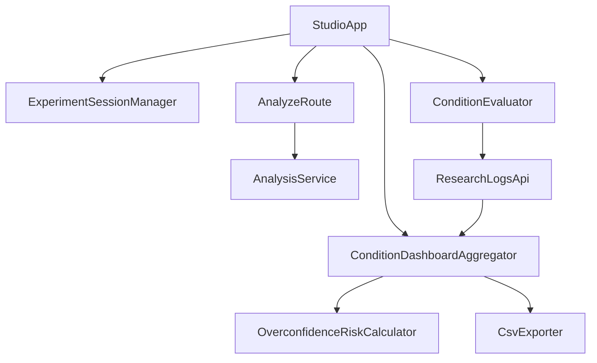
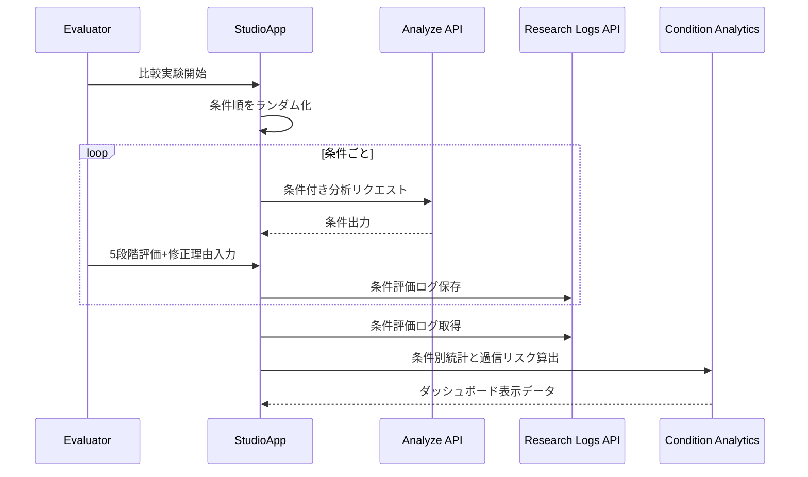

# Design Document

## Overview
本機能は、気候変動報道向け AI 出力の A/B/C 条件比較実験を、既存 Studio 画面上で実施できるようにする。研究者・編集者・リサーチャーは同一入力に対する複数条件の出力をランダム順で評価し、条件別の有効性とリスクを継続的に検証できる。

既存の分析導線（入力 -> 分析 -> 評価保存）は維持しつつ、比較セッションモデルと条件別統計集計を追加する。ダッシュボードでは正確性・有用性・信頼性の条件別平均、修正理由分布、過信リスク指標を表示し、研究用途のデータ出力を可能にする。

### Goals
- A/B/C 条件比較セッションをランダム提示付きで運用できること
- 条件ごとの 5 段階評価・修正理由・コメントを一貫収集できること
- 条件別統計と過信リスク指標をダッシュボードで可視化できること

### Non-Goals
- 外部 BI ツールとの自動連携
- 研究倫理審査や同意管理ワークフローの実装
- モデル最適化を伴う自動条件探索

## Boundary Commitments

### This Spec Owns
- 比較実験セッション（条件ID、提示順、評価記録）の管理契約
- 条件別評価統計・修正理由分布・過信リスク指標の算出契約
- 条件別ダッシュボード表示と研究データ出力の拡張

### Out of Boundary
- 外部分析基盤・BI・データウェアハウス連携
- 新規認証/権限管理
- 研究プロトコルの行政・法務要件処理

### Allowed Dependencies
- `components/studio-app.tsx`（UI導線拡張）
- `app/api/analyze/route.ts`（既存分析API）
- `lib/types.ts`（型SSOT）
- `lib/csv.ts`（研究データ出力）
- 既存研究ログ保存 API（`/api/research-logs`）

### Revalidation Triggers
- `ResearchLog` または比較セッション型の必須項目変更
- 条件別集計結果のキー/意味の変更
- ダッシュボード出力形式（CSV列含む）の変更
- ランダム提示ルールの変更

## Architecture

### Existing Architecture Analysis
- 現在は単一分析結果を前提に `StudioApp` が評価入力とダッシュボード集計を保持。
- `ResearchLog` は条件比較メタデータを持たず、条件別集計に必要な軸が不足。
- 既存 API は単一分析入力契約で、比較セッション情報を扱わない。

### Architecture Pattern & Boundary Map
- Selected pattern: **Experiment Session Orchestrator + Condition Analytics**
- Domain/feature boundaries:
  - UI: 比較セッション進行、条件表示、評価入力
  - Domain: 条件ランダム化、条件別集計、過信リスク算出
  - Storage contract: 比較メタデータ付き研究ログ保存
- Existing patterns preserved: `lib` 純粋関数中心、`types.ts` SSOT、`StudioApp` 主導の UI フロー。
- New components rationale: 比較実験管理と統計集計を分離し、UIの肥大化と集計ロジック重複を防ぐ。
- Steering compliance: `components -> lib` 依存を維持し、逆依存を作らない。



### Technology Stack

| Layer | Choice / Version | Role in Feature | Notes |
|-------|------------------|-----------------|-------|
| Frontend | React 19 + HeroUI v3 | 比較実験UI、評価フォーム、条件別ダッシュボード | 既存画面拡張 |
| Backend | Next.js 16 Route Handlers | 分析API・研究ログAPIの契約維持 | 既存 API 連携 |
| Domain | TypeScript strict | ランダム提示、条件別統計、過信リスク算出 | `any` 不使用 |
| Data / Storage | 既存研究ログ保存基盤 | 条件メタデータ付きログ保存 | 既存契約を拡張 |
| Runtime | Bun | 実行・型検証 | 新規依存追加なし |

## File Structure Plan

### Directory Structure
```text
app/
└── api/
    ├── analyze/
    │   └── route.ts                      # 既存分析API（比較条件メタ入力を許容）
    └── research-logs/
        └── route.ts                      # 比較メタデータ付きログ保存契約

components/
└── studio-app.tsx                        # 比較セッションUI、評価フォーム、条件別ダッシュボード表示

lib/
├── types.ts                              # 比較セッション・条件評価・統計型
├── csv.ts                                # 条件別列を含む研究データCSV出力
├── experiment-session.ts                 # 条件ランダム化・提示順管理
├── condition-analytics.ts                # 条件別平均/分布集計
└── overconfidence-risk.ts                # 過信リスク指標算出
```

### Modified Files
- `components/studio-app.tsx` — A/B/C 比較表示、ランダム提示、条件別評価入力、条件別ダッシュボードを追加。
- `lib/types.ts` — 比較セッション・条件評価・過信リスク関連型を追加。
- `lib/csv.ts` — 条件ID・提示順・比較セッション列をCSVへ追加。
- `app/api/research-logs/route.ts` — 比較メタデータの保存・取得契約を拡張。
- `app/api/analyze/route.ts` — 比較実験時の条件情報を受け取れる入力契約を維持的に拡張。

## System Flows



## Requirements Traceability

| Requirement | Summary | Components | Interfaces | Flows |
|-------------|---------|------------|------------|-------|
| 1.1 | A/B/C 条件比較提示 | ExperimentSessionManager, StudioApp | ComparisonSession contract | Sequence flow |
| 1.2 | 条件ラベル・提示順記録 | ExperimentSessionManager, Research Logs API | ConditionOrder contract | Sequence flow |
| 1.3 | 欠損条件の明示 | StudioApp, Analyze API adapter | ConditionError contract | Sequence flow |
| 1.4 | 比較前提統一 | StudioApp, ExperimentSessionManager | SharedInput contract | Sequence flow |
| 2.1 | ランダム提示 | ExperimentSessionManager | Randomization policy | Sequence flow |
| 2.2 | 5段階評価入力 | ConditionEvaluator UI | ConditionRating contract | Sequence flow |
| 2.3 | 修正理由/コメント記録 | ConditionEvaluator, Research Logs API | ConditionFeedback contract | Sequence flow |
| 2.4 | 未入力ガード | ConditionEvaluator UI | Validation error contract | Sequence flow |
| 3.1 | 条件別平均表示 | ConditionDashboardAggregator | ConditionSummary contract | Sequence flow |
| 3.2 | 修正理由分布比較 | ConditionDashboardAggregator | ReasonDistribution contract | Sequence flow |
| 3.3 | データ不足表示 | ConditionDashboardAggregator, StudioApp | DataSufficiency contract | Sequence flow |
| 3.4 | 研究データ出力 | CsvExporter | ConditionCsv contract | Sequence flow |
| 4.1 | 過信リスク算出 | OverconfidenceRiskCalculator | RiskMetric contract | Sequence flow |
| 4.2 | 閾値超過警告 | OverconfidenceRiskCalculator, StudioApp | RiskAlert contract | Sequence flow |
| 4.3 | 算出根拠表示 | ConditionDashboardAggregator | RiskBreakdown contract | Sequence flow |
| 4.4 | 自動断定回避 | OverconfidenceRiskCalculator policy | InterpretationPolicy contract | Sequence flow |

## Components and Interfaces

| Component | Domain/Layer | Intent | Req Coverage | Key Dependencies (P0/P1) | Contracts |
|-----------|--------------|--------|--------------|--------------------------|-----------|
| ExperimentSessionManager | Domain | 条件順ランダム化とセッション状態管理 | 1.1, 1.2, 1.4, 2.1 | types(P0), StudioApp(P1) | Service, State |
| ConditionEvaluator | UI/Domain | 条件別評価入力と検証 | 2.2, 2.3, 2.4 | StudioApp(P0), Research Logs API(P0) | API, State |
| ConditionDashboardAggregator | Domain | 条件別統計・分布・不足判定 | 3.1, 3.2, 3.3, 3.4, 4.3 | research logs(P0), csv(P1) | Service |
| OverconfidenceRiskCalculator | Domain | 過信リスク指標と警告判定 | 4.1, 4.2, 4.4 | condition analytics(P0) | Service |
| Research Logs API extension | API | 比較メタ付き評価ログ保存・取得 | 1.2, 2.3, 3.4 | types(P0) | API |

### Domain Layer

#### ExperimentSessionManager
| Field | Detail |
|-------|--------|
| Intent | 条件提示順の生成と比較セッション整合性を管理 |
| Requirements | 1.1, 1.2, 1.4, 2.1 |

**Responsibilities & Constraints**
- 条件集合（A/B/C）から提示順を生成しセッションへ固定する。
- 同一セッション内で入力本文と条件以外の前提差分を持ち込まない。

**Dependencies**
- Inbound: `StudioApp` — 実験開始要求 (P0)
- Outbound: `lib/types.ts` — セッション契約 (P0)

**Contracts**: Service [x] / API [ ] / Event [ ] / Batch [ ] / State [x]

#### ConditionDashboardAggregator
| Field | Detail |
|-------|--------|
| Intent | 条件別評価統計・分布・データ不足判定を集約 |
| Requirements | 3.1, 3.2, 3.3, 3.4, 4.3 |

**Responsibilities & Constraints**
- 条件ごとの平均評価と修正理由分布を計算する。
- 件数不足時は注意フラグを返す。
- CSV出力で再分析可能な列構成を提供する。

**Dependencies**
- Inbound: `Research Logs API extension` — 条件評価ログ (P0)
- Outbound: `OverconfidenceRiskCalculator` — リスク算出 (P0)
- Outbound: `lib/csv.ts` — エクスポート (P1)

**Contracts**: Service [x] / API [ ] / Event [ ] / Batch [ ] / State [ ]

#### OverconfidenceRiskCalculator
| Field | Detail |
|-------|--------|
| Intent | 高信頼評価かつ修正発生の過信リスクを条件別に算出 |
| Requirements | 4.1, 4.2, 4.4 |

**Responsibilities & Constraints**
- 閾値判定で警告可否を返す。
- 指標は解釈支援のみで品質断定は行わない。

**Dependencies**
- Inbound: `ConditionDashboardAggregator` — 条件別統計 (P0)
- Outbound: `StudioApp` — 警告表示モデル (P1)

**Contracts**: Service [x] / API [ ] / Event [ ] / Batch [ ] / State [ ]

## Data Models

### Domain Model
- `ExperimentSession`: `sessionId`, `inputId`, `conditionOrder`, `startedAt`
- `ConditionEvaluation`: `sessionId`, `conditionId`, `displayOrder`, `accuracy`, `usefulness`, `trust`, `revisionReasons`, `comment`
- `ConditionStatistics`: 条件別平均、件数、分布
- `OverconfidenceRiskMetric`: 条件別の高信頼×修正発生率、閾値判定、根拠件数

### Logical Data Model
- 1セッションに複数条件評価（1:N）。
- 条件評価は `conditionId` で統計集約。
- 既存 `ResearchLog` は拡張列をオプショナルで持ち、後方互換を維持する。

### Data Contracts & Integration
- `ResearchLog` に `experiment_session_id`, `condition_id`, `condition_display_order` を追加。
- ダッシュボード集計は条件別件数が閾値未満の場合 `insufficientData=true` を返す。
- CSV は条件比較列を追加し、既存列順との互換性を維持する。

## Error Handling

### Error Strategy
- 条件出力欠損は比較セッション継続可能な警告として扱う。
- 評価入力不足は保存前に検証エラーを返す。
- 集計対象データ不足は表示上の注意として返す。

### Error Categories and Responses
- **User Errors (4xx)**: 評価未入力、無効条件ID
- **System Errors (5xx)**: ログ保存/取得失敗、集計処理失敗
- **Business Logic Errors (422相当)**: 条件欠損、データ不足

### Monitoring
- 条件別評価件数、欠損率、過信リスク警告率を記録する。
- ランダム提示順の偏りを監視する。

## Testing Strategy

### Unit Tests
- 条件ランダム化が重複なく提示順を生成すること（2.1）。
- 条件別平均・分布集計が正しく算出されること（3.1, 3.2）。
- 過信リスク指標と警告判定が閾値どおりに動作すること（4.1, 4.2, 4.4）。

### Integration Tests
- 条件出力取得から評価保存までセッション単位で整合すること（1.1, 1.2, 2.3）。
- 未入力項目で保存が拒否されること（2.4）。
- 条件別ダッシュボードでデータ不足表示が出ること（3.3）。

### E2E/UI Tests
- A/B/C 比較開始 -> ランダム提示 -> 条件別評価入力 -> 保存 -> ダッシュボード確認の導線が成立すること。
- 過信リスク警告時に根拠件数と内訳を確認できること（4.3）。

### Performance/Load
- セッション数増加時も条件別集計の応答が実用範囲であること。
- CSV出力が条件列追加後も実用時間内に完了すること。
