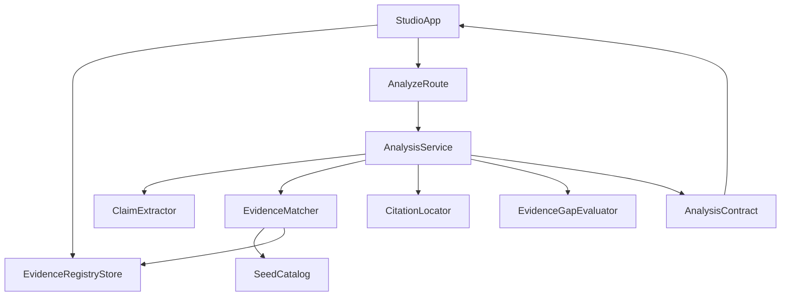
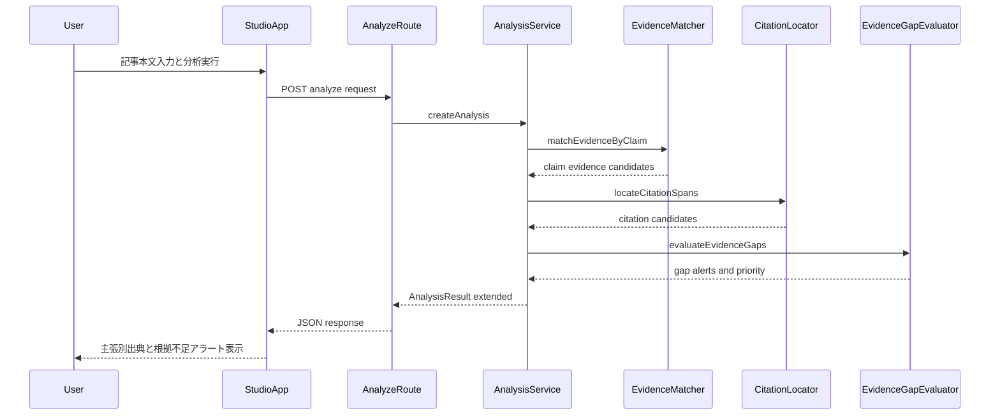

# Design Document

## Overview
本機能は、気候変動報道の検証時に必要となる根拠資料を「登録可能な資料レジストリ」として管理し、分析時に主張ごとの関連資料・参照箇所候補・根拠不足アラートを返す。これにより、編集者・記者・リサーチャーが毎回外部サイトを横断検索する負荷を削減し、出典付きの編集判断を一画面で完結できる状態を作る。

既存の `StudioApp` → `/api/analyze` → `createAnalysis()` 境界は維持し、分析ドメインを拡張する。MVP では「シード資料 + ユーザー登録資料」を統合検索する簡易 RAG とし、最終判断は人間が行う編集支援方針を保持する。

### Goals
- PDF/URL 根拠資料の登録・更新・無効化を、既存 UI フロー内で扱えるようにする。
- 主張単位で関連資料候補と参照箇所候補を提示し、編集メモに主張-出典対応を含める。
- 根拠不足アラートを主張単位で提示し、優先確認対象を識別できるようにする。

### Non-Goals
- 有料データベースやクローズドソースへの自動ログイン取得
- 記事公開可否や法的妥当性の自動断定
- 認証・権限管理の新規導入

## Boundary Commitments

### This Spec Owns
- 根拠資料レジストリ（シード + ユーザー登録）を分析入力に統合する契約
- 主張ごとの資料候補・参照箇所候補・根拠不足アラート生成
- 編集メモ内の主張-出典紐づけ表示のための結果契約拡張

### Out of Boundary
- 認証、組織単位のアクセス制御
- 外部有償データの取得代行
- 埋め込み専用基盤や外部ベクトル DB への移行実装

### Allowed Dependencies
- 既存 Route Handler: `app/api/analyze/route.ts`
- 既存分析オーケストレータ: `lib/analysis.ts`
- 既存型 SSOT: `lib/types.ts`
- 既存権威ソースカタログ: `data/evidence-sources.ts`
- 既存 UI コンテナ: `components/studio-app.tsx`

### Revalidation Triggers
- `AnalysisResult` の主張・出典・アラート契約変更
- 根拠資料エンティティの必須項目変更（資料種別、状態、識別子）
- 分析処理の依存方向変更（`lib` から UI への逆依存発生など）
- レジストリ保存先の変更（localStorage 以外への移行）

## Architecture

### Existing Architecture Analysis
- 現在は静的 `EvidenceSource[]` からテーマ一致で候補を返すのみで、資料登録機能は未実装。
- `/api/analyze` は入力検証後に同期解析を呼ぶ薄い API 層であり、契約拡張の受け口として再利用可能。
- `lib` 層は純粋関数中心のため、I/O は UI 層で保持し、解析計算のみ `lib` に集約するのが整合的。

### Architecture Pattern & Boundary Map
- Selected pattern: **Client-managed Registry + Analysis Orchestrator**
- Domain/feature boundaries: 資料保存は UI、資料検索と主張紐づけは `lib`、外部公開契約は `/api/analyze` が所有。
- Existing patterns preserved: 型 SSOT、`@/` import、`app` の薄い責務、`lib` 純粋関数方針。
- New components rationale: 登録資料管理、資料検索スコアリング、参照箇所候補生成、根拠不足判定を分離して責務衝突を防ぐ。
- Steering compliance: 依存方向を `app/components` → `lib` ← `data` に固定し、逆依存を発生させない。



### Technology Stack

| Layer | Choice / Version | Role in Feature | Notes |
|-------|------------------|-----------------|-------|
| Frontend | React 19 / HeroUI v3 | 資料登録 UI、アラート表示、出典紐づけ表示 | 既存 `StudioApp` を拡張 |
| Backend | Next.js 16 Route Handler | 分析 API 契約受け口 | `/api/analyze` 契約維持 |
| Domain | TypeScript 5.9 strict | 主張抽出、資料照合、参照箇所候補、アラート判定 | `any` 不使用 |
| Data | Static seed + localStorage | 権威ソース維持とユーザー登録資料保持 | MVP の段階導入 |
| Runtime | Bun | 既存実行環境 | 追加基盤なし |

## File Structure Plan

### Directory Structure
```text
app/
└── api/
    ├── analyze/
    │   └── route.ts                         # 分析入力契約拡張と応答整形
    └── evidence-sources/
        └── route.ts                         # 登録資料の受け口（将来の保存先差し替え境界）

components/
└── studio-app.tsx                           # 資料登録UI、主張別出典表示、根拠不足アラート表示

lib/
├── analysis.ts                              # 既存入口。新マッチング処理を統合
├── types.ts                                 # EvidenceRegistryEntry, ClaimEvidenceLink などの型定義
├── evidence-registry.ts                     # 登録資料のバリデーションと統合取得契約
├── evidence-matcher.ts                      # 主張×資料の関連度算出と候補生成
├── citation-locator.ts                      # 参照箇所候補の抽出・確度判定
└── evidence-gap.ts                          # 根拠不足判定と優先確認スコア算出

data/
└── evidence-sources.ts                      # 権威ソースのシードカタログ（読み取り専用）
```

### Modified Files
- `lib/types.ts` — 根拠資料登録エンティティ、主張-出典リンク、根拠不足アラート型を追加する。
- `lib/analysis.ts` — 主張単位の候補検索・参照箇所候補・アラート生成フローを統合する。
- `components/studio-app.tsx` — 資料登録操作と主張別の根拠表示を追加する。
- `app/api/analyze/route.ts` — 拡張された `AnalysisRequest`/`AnalysisResult` の検証と返却を維持する。
- `data/evidence-sources.ts` — シード資料に必要なメタ項目を補完する（既存責務は維持）。

## System Flows



- 参照箇所確度が低い場合は `estimated=true` を返し、再確認を UI で明示する。
- 候補ゼロの主張は `sources=[]` と `gapAlert` で明示し、メモに追加取材方針を含める。

## Requirements Traceability

| Requirement | Summary | Components | Interfaces | Flows |
|-------------|---------|------------|------------|-------|
| 1.1 | PDF/URL 登録成功時に一覧反映 | EvidenceRegistryStore, EvidenceRegistryService | EvidenceSource API contract | Register flow |
| 1.2 | 重複/参照不能を通知 | EvidenceRegistryService, StudioApp | Registry validation result | Register flow |
| 1.3 | メタ情報保持 | `types.ts` model, EvidenceRegistryStore | EvidenceRegistryEntry contract | Register flow |
| 1.4 | 修正/無効化反映 | EvidenceRegistryService, EvidenceMatcher | Registry state contract | Analyze flow |
| 2.1 | 主張ごとの資料候補提示 | AnalysisService, EvidenceMatcher | ClaimEvidenceLink[] | Analyze flow |
| 2.2 | 関連度順提示 | EvidenceMatcher | EvidenceMatchScore contract | Analyze flow |
| 2.3 | 候補なし明示 | AnalysisService, EvidenceGapEvaluator | GapAlert contract | Analyze flow |
| 2.4 | 候補ごとのアクセス情報 | EvidenceMatcher, StudioApp | EvidenceReference view model | Analyze flow |
| 3.1 | 参照箇所候補提示 | CitationLocator, AnalysisService | CitationSpan contract | Analyze flow |
| 3.2 | 確度不足時の再確認促し | CitationLocator, StudioApp | CitationConfidence flag | Analyze flow |
| 3.3 | メモで主張-出典対応表示 | AnalysisService, StudioApp | MemoSourceLink contract | Analyze flow |
| 3.4 | 追跡可能な識別情報 | `types.ts`, AnalysisService | SourceId / ClaimId contract | Analyze flow |
| 4.1 | 根拠不足アラート提示 | EvidenceGapEvaluator, StudioApp | GapAlert[] | Analyze flow |
| 4.2 | 複数アラートの優先識別 | EvidenceGapEvaluator | GapPriority score | Analyze flow |
| 4.3 | 追加確認方向性を提示 | AnalysisService memo composer | MemoGuidance fields | Analyze flow |
| 4.4 | 自動断定しない | AnalysisService policy rules | AlertPolicy contract | Analyze flow |

## Components and Interfaces

| Component | Domain/Layer | Intent | Req Coverage | Key Dependencies (P0/P1) | Contracts |
|-----------|--------------|--------|--------------|--------------------------|-----------|
| EvidenceRegistryService | Domain | 登録資料の検証・統合管理 | 1.1, 1.2, 1.3, 1.4 | types(P0), StudioApp(P1) | Service |
| EvidenceMatcher | Domain | 主張ごとの関連資料スコアリング | 2.1, 2.2, 2.4 | seed catalog(P0), registry(P0) | Service |
| CitationLocator | Domain | 参照箇所候補と確度判定 | 3.1, 3.2 | matcher(P0), analysis text(P0) | Service |
| EvidenceGapEvaluator | Domain | 根拠不足判定と優先度計算 | 2.3, 4.1, 4.2, 4.4 | matcher(P0), locator(P1) | Service |
| AnalysisService (`createAnalysis`) | Domain | 各コンポーネントを統合して結果を返す | 2.1-4.4 | matcher(P0), locator(P0), gap evaluator(P0) | Service |
| StudioApp Extensions | UI | 資料登録操作と結果可視化 | 1.1-1.4, 2.4, 3.2, 3.3, 4.1-4.3 | analyze API(P0) | API, State |

### Domain Layer

#### EvidenceRegistryService

| Field | Detail |
|-------|--------|
| Intent | 登録資料の追加・更新・無効化・重複判定を担当 |
| Requirements | 1.1, 1.2, 1.3, 1.4 |

**Responsibilities & Constraints**
- URL 正規化と資料識別子の一貫性を維持する。
- 重複・参照不能を判定し、利用者向け理由コードを返す。
- シード資料は読み取り専用として扱う。

**Dependencies**
- Inbound: `StudioApp` — 登録/更新要求 (P0)
- Outbound: `lib/types.ts` — 契約型 (P0)
- External: localStorage adapter — ユーザー登録保持 (P1)

**Contracts**: Service [x] / API [ ] / Event [ ] / Batch [ ] / State [ ]

##### Service Interface
```typescript
interface EvidenceRegistryService {
  upsert(entry: EvidenceRegistryEntry): RegistryResult;
  deactivate(sourceId: string): RegistryResult;
  listActive(): EvidenceRegistryEntry[];
}
```
- Preconditions: `url`, `title`, `owner`, `sourceType` が入力済み。
- Postconditions: 登録状態と理由コードを返す。
- Invariants: `sourceId` は一意で、無効化状態が検索に反映される。

#### EvidenceMatcher

| Field | Detail |
|-------|--------|
| Intent | 抽出主張と根拠資料を関連度順に対応づける |
| Requirements | 2.1, 2.2, 2.4 |

**Responsibilities & Constraints**
- 主張テキストとテーマ一致を用いてスコアリングする。
- 上位候補とアクセス情報（URL、出典名）を返す。
- 候補ゼロ時は空配列を返し、後段判定に委譲する。

**Dependencies**
- Inbound: `AnalysisService` — 主張配列 (P0)
- Outbound: `data/evidence-sources.ts` — 権威シード (P0)
- Outbound: `EvidenceRegistryService` — ユーザー登録資料 (P0)

**Contracts**: Service [x] / API [ ] / Event [ ] / Batch [ ] / State [ ]

#### CitationLocator

| Field | Detail |
|-------|--------|
| Intent | 主張に対する参照箇所候補と確度を生成 |
| Requirements | 3.1, 3.2 |

**Responsibilities & Constraints**
- 資料ノート・タイトル・主張語彙から参照箇所候補文を抽出する。
- 確度が閾値未満の場合 `estimated` を true とする。

**Dependencies**
- Inbound: `EvidenceMatcher` — 候補資料 (P0)
- Outbound: `AnalysisService` — 参照箇所候補 (P0)

**Contracts**: Service [x] / API [ ] / Event [ ] / Batch [ ] / State [ ]

#### EvidenceGapEvaluator

| Field | Detail |
|-------|--------|
| Intent | 根拠不足判定と優先確認順位を算出 |
| Requirements | 2.3, 4.1, 4.2, 4.4 |

**Responsibilities & Constraints**
- 候補資料ゼロ、低確度候補のみ、無効資料のみのケースを警告対象にする。
- 記事全体での優先度を `high`/`medium`/`low` で付与する。
- 警告は判断補助に限定し、真偽断定フラグを持たせない。

**Dependencies**
- Inbound: `AnalysisService` — 主張別候補情報 (P0)
- Outbound: `StudioApp` — アラート表示モデル (P0)

**Contracts**: Service [x] / API [ ] / Event [ ] / Batch [ ] / State [ ]

### API/UI Layer

#### AnalyzeRoute

| Field | Detail |
|-------|--------|
| Intent | 拡張された分析入出力契約の境界管理 |
| Requirements | 2.1, 2.3, 3.3, 4.1 |

**Responsibilities & Constraints**
- 必須入力の検証を維持し、拡張結果を JSON で返す。
- 契約外フィールドは返さない。

**Contracts**: Service [ ] / API [x] / Event [ ] / Batch [ ] / State [ ]

##### API Contract
| Method | Endpoint | Request | Response | Errors |
|--------|----------|---------|----------|--------|
| POST | /api/analyze | AnalysisRequestExtended | AnalysisResultExtended | 400, 500 |
| POST | /api/evidence-sources | EvidenceRegistryEntry | RegistryResult | 400, 409, 500 |

## Data Models

### Domain Model
- `EvidenceRegistryEntry`: ユーザー登録資料（`sourceId`, `title`, `owner`, `url`, `sourceType`, `status`, `updatedAt`）
- `ClaimEvidenceLink`: 主張と資料候補の対応（`claimId`, `sourceId`, `score`, `citationCandidates`）
- `GapAlert`: 根拠不足情報（`claimId`, `severity`, `priority`, `reason`, `guidance`）
- `AnalysisResultExtended`: 既存 `AnalysisResult` に `claimEvidenceLinks` と `gapAlerts` を追加した結果契約

### Logical Data Model
- 1つの主張は複数資料候補を持てる（1:N）。
- 1つの資料は複数主張に再利用される（N:1）。
- `sourceId` を共通キーにし、メモ内の出典追跡を可能にする。
- 資料状態は `active`/`inactive` を保持し、検索対象を制御する。

### Data Contracts & Integration
- `AnalysisRequest` に `registeredSources` を追加可能な拡張余地を持たせる。
- `AnalysisResultExtended` は既存 UI が破綻しない後方互換構造（既存キーは維持）で返す。
- 参照箇所候補は `text`, `confidence`, `estimated` を最小契約とする。

## Error Handling

### Error Strategy
- 登録時バリデーション失敗（欠落、無効 URL）: 利用者が修正可能なエラーとして返す。
- 重複登録: 競合エラーとして理由コード付きで返す。
- 分析時候補ゼロ: システムエラーではなく業務警告（`gapAlerts`）として扱う。

### Error Categories and Responses
- **User Errors (4xx)**: 入力不足、URL 不正、重複登録
- **System Errors (5xx)**: レジストリ読み込み失敗、解析中例外
- **Business Logic Errors (422相当)**: 根拠不足、低確度参照箇所（処理継続）

### Monitoring
- 根拠不足アラート率（記事単位・主張単位）を記録する。
- 重複登録と参照不能登録の発生率を運用指標にする。

## Testing Strategy

### Unit Tests
- 1.2: `EvidenceRegistryService` が重複 URL を検出し理由コードを返すこと。
- 2.2: `EvidenceMatcher` がスコア順で候補を返すこと。
- 3.2: `CitationLocator` が低確度時に `estimated=true` を返すこと。
- 4.4: `EvidenceGapEvaluator` が真偽断定フラグを返さないこと。

### Integration Tests
- 1.1/1.4: 資料登録後に分析結果へ反映され、無効化後は候補から除外されること。
- 2.1/2.3: 主張ごとに候補表示され、候補ゼロ主張は `gapAlerts` に含まれること。
- 3.1/3.3: 主張-出典紐づけが編集メモに反映されること。
- 4.2: 複数アラート発生時に優先度が付与されること。

### E2E/UI Tests
- 記事入力 → 資料登録 → 分析実行 → 主張別出典確認まで単一画面で完了できること。
- 根拠不足アラート表示時に、追加確認ガイダンスが可視化されること。
- 参照箇所が推定の場合、再確認が必要である旨が表示されること。

### Performance/Load
- 主張数増加時でも候補生成が実用遅延以内であること（既存分析体験を著しく悪化させない）。
- 登録資料件数増加時に上位候補抽出の応答劣化を監視する。
