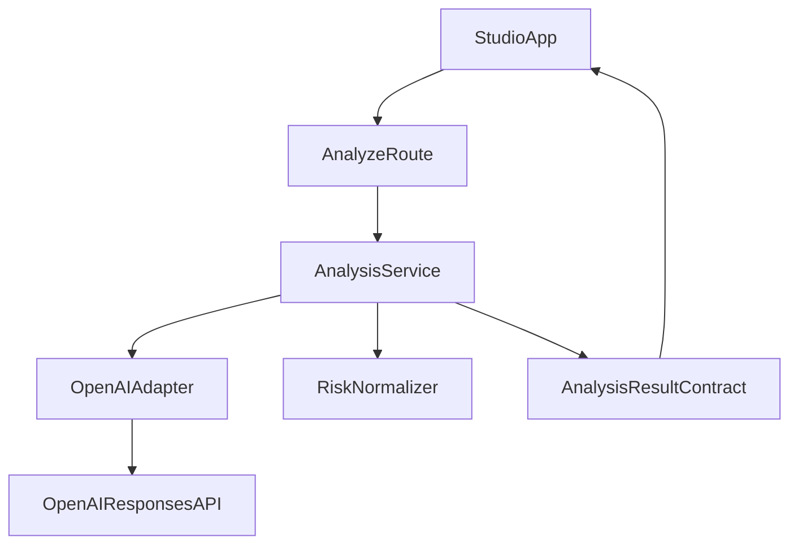
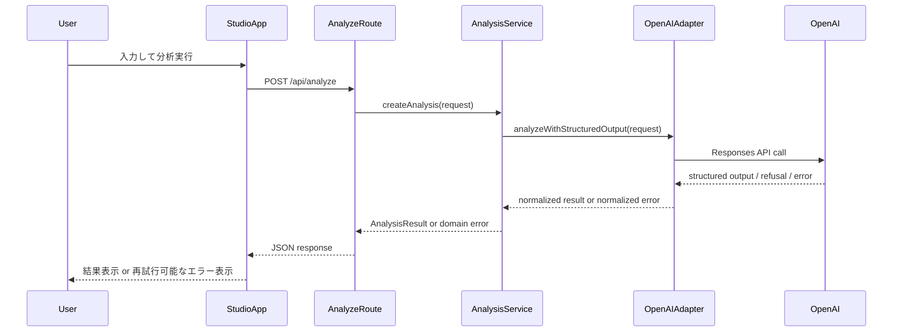

# Design Document

## Overview
本機能は、既存のルールベース解析を OpenAI API ベースの構造化解析へ拡張し、編集者・記者・リサーチャーが「主張」「リスク」「根拠確認ポイント」「編集支援メモ」を一度に受け取れる状態を作る。既存の UI 導線（入力→分析→人間評価）を維持しつつ、分析品質を向上させる。

利用者は現行どおり単一画面で入力し、`/api/analyze` の結果をレビューして修正判断を行う。本設計は API 境界を固定し、内部の解析実装のみを差し替えることで、既存機能への影響を最小化する。

### Goals
- OpenAI API を用いて、要件で定義した分析要素を構造化返却する。
- 既存の人間評価フローと入力項目互換を維持する。
- 失敗時に利用者が再試行・入力見直しを判断できるエラー応答を定義する。

### Non-Goals
- 認証・権限管理の導入
- 監査ログ永続化方式の変更
- RAG や根拠資料 PDF 取り込みの実装

## Boundary Commitments

### This Spec Owns
- `/api/analyze` の解析実行経路における OpenAI 連携
- 構造化出力（主張・リスク・根拠確認ポイント・編集支援メモ）の契約定義と検証
- 外部 API 失敗時の業務エラー分類とレスポンス方針

### Out of Boundary
- 評価ログ保存（localStorage/Supabase）処理
- 認証、利用者管理、アクセス制御
- 根拠ソース管理方式の抜本変更（RAG 等）

### Allowed Dependencies
- OpenAI Responses API（外部推論）
- 既存 Next.js Route Handler (`app/api/analyze/route.ts`)
- 既存型定義 (`lib/types.ts`) と UI 表示契約 (`components/studio-app.tsx`)

### Revalidation Triggers
- 解析レスポンスの項目構造変更（キー名、必須/任意、配列構造）
- `/api/analyze` のエラー形式変更
- OpenAI API モデル/レスポンス仕様変更
- 入力項目（タイトル、媒体種別、トピック、本文）の契約変更

## Architecture

### Existing Architecture Analysis
- 現在は `StudioApp` → `/api/analyze` → `createAnalysis()` の単一路線。
- `lib/analysis.ts` がルールベース主処理を担い、Route Handler は入力検証と返却のみ担当。
- 既存契約を維持しつつ内部実装を交換できる構造がある。

### Architecture Pattern & Boundary Map
- Selected pattern: **Route Handler Orchestrator + OpenAI Adapter**
- Domain/feature boundaries: 入出力契約は `analysis` ドメインが所有、UI は表示責務のみ、外部 API 呼び出しは adapter に集約。
- Existing patterns preserved: `app` は薄い境界、`lib` はドメインロジック、`@/` import 規約、型 SSOT。
- New components rationale: OpenAI 呼び出し・構造化検証・エラー正規化を分離し、責務衝突を回避。
- Steering compliance: `lib` の関数中心構造を維持し、境界外責務を追加しない。



### Technology Stack

| Layer | Choice / Version | Role in Feature | Notes |
|-------|------------------|-----------------|-------|
| Frontend | React 19 / HeroUI | 既存結果表示と評価入力の継続 | 画面契約維持、最小変更 |
| Backend | Next.js 16 Route Handler | 解析要求の受け口、エラー整形 | `/api/analyze` 維持 |
| Domain | TypeScript strict | 解析契約、型安全、検証 | `any` 不使用 |
| External AI | OpenAI Responses API | 構造化解析生成 | JSON 構造化出力前提 |
| Runtime | Bun + Node互換 | サーバ実行 | 既存運用継続 |

## File Structure Plan

### Directory Structure
```text
app/
└── api/
    └── analyze/
        └── route.ts                  # 入力検証・呼び出し・エラー整形

lib/
├── analysis.ts                       # 解析オーケストレータ（公開入口）
├── types.ts                          # 分析結果契約（既存 + 拡張）
├── openai-analysis/
│   ├── adapter.ts                    # OpenAI Responses API 呼び出し
│   ├── schema.ts                     # 構造化出力スキーマ定義
│   ├── mapper.ts                     # OpenAI結果 -> AnalysisResult 変換
│   └── errors.ts                     # 外部APIエラー正規化
└── prompts/
    └── analysis-prompt.ts            # 主張抽出・リスク判定プロンプト組み立て
```

### Modified Files
- `app/api/analyze/route.ts` — OpenAI 失敗時の分類済みエラー応答を追加し、利用者の再試行判断を可能にする。
- `lib/analysis.ts` — 既存入口を維持しつつ、OpenAI adapter を呼ぶオーケストレーションへ移行する。
- `lib/types.ts` — 構造化出力と UI 契約が同期するよう型を拡張・明確化する。
- `components/studio-app.tsx` — API 失敗時メッセージ表示の受け口のみ最小調整（必要時）。
- `package.json` — OpenAI SDK 依存追加（実装段階）。

## System Flows



## Requirements Traceability

| Requirement | Summary | Components | Interfaces | Flows |
|-------------|---------|------------|------------|-------|
| 1.1 | 入力送信で文脈主張を複数提示 | AnalyzeRoute, AnalysisService, OpenAIAdapter | `/api/analyze` request/response | Sequence flow |
| 1.2 | 主張不在時の明示 | AnalysisService, mapper | AnalysisResult contract | Sequence flow |
| 1.3 | 言い換え重複の統合 | mapper, schema | Structured output schema | Sequence flow |
| 1.4 | レビューしやすい粒度 | mapper, types | AnalysisResult ordering rules | Sequence flow |
| 2.1 | 主張ごとのリスク明示 | AnalysisService, mapper | Risk contract | Sequence flow |
| 2.2 | 主要4リスクの識別 | schema, mapper | Risk labels contract | Sequence flow |
| 2.3 | 根拠確認ポイント提示 | mapper, prompts | memo/source hint fields | Sequence flow |
| 2.4 | 最終判断は人間前提 | prompts, mapper | memo wording policy | Sequence flow |
| 3.1 | 統合メモ提示 | AnalysisService, mapper | memo field | Sequence flow |
| 3.2 | 表現緩和提案 | prompts, mapper | memo field | Sequence flow |
| 3.3 | 単一画面で読了可能 | StudioApp | existing result panel interface | Sequence flow |
| 3.4 | 修正判断材料の欠落防止 | schema, mapper | required fields contract | Sequence flow |
| 4.1 | 構造化データ返却 | OpenAIAdapter, schema, AnalyzeRoute | structured response contract | Sequence flow |
| 4.2 | 再試行判断可能エラー | AnalyzeRoute, errors | error envelope contract | Sequence flow |
| 4.3 | 既存評価フロー継続 | StudioApp, types | AnalysisResult compatibility | Sequence flow |
| 4.4 | 既存入力項目で利用可能 | AnalyzeRoute, AnalysisService | AnalysisRequest contract | Sequence flow |

## Components and Interfaces

| Component | Domain/Layer | Intent | Req Coverage | Key Dependencies (P0/P1) | Contracts |
|-----------|--------------|--------|--------------|--------------------------|-----------|
| AnalyzeRoute | API | 入力検証と応答整形 | 1.1, 4.2, 4.4 | AnalysisService(P0) | API |
| AnalysisService | Domain | 解析全体オーケストレーション | 1.1-3.4, 4.1 | OpenAIAdapter(P0), mapper(P0) | Service |
| OpenAIAdapter | External Integration | OpenAI 呼び出しと一次検証 | 1.1, 4.1, 4.2 | OpenAI API(P0), schema(P0) | Service |
| mapper | Domain | 構造化出力を契約型へ変換 | 1.2-3.4, 4.1 | types(P0) | Service |
| errors | Domain | 外部エラーの業務分類 | 4.2 | OpenAIAdapter(P0), AnalyzeRoute(P0) | Service |

### API Layer

#### AnalyzeRoute

| Field | Detail |
|-------|--------|
| Intent | 入力必須項目検証と API 応答契約維持 |
| Requirements | 1.1, 4.2, 4.4 |

**Responsibilities & Constraints**
- 入力不足は 400 として即時返却する。
- 解析エラーを「再試行可能 / 不可」で分類して返す。
- 成功時レスポンス形状は既存 UI 互換を維持する。

**Dependencies**
- Inbound: `StudioApp` — 分析要求送信 (P0)
- Outbound: `AnalysisService` — 解析実行 (P0)
- Outbound: `errors` — エラー分類利用 (P0)

**Contracts**: Service [ ] / API [x] / Event [ ] / Batch [ ] / State [ ]

##### API Contract
| Method | Endpoint | Request | Response | Errors |
|--------|----------|---------|----------|--------|
| POST | /api/analyze | AnalysisRequest | AnalysisResult | 400, 429, 500, 502 |

### Domain Layer

#### AnalysisService

| Field | Detail |
|-------|--------|
| Intent | 入力から最終 `AnalysisResult` 生成までを統括 |
| Requirements | 1.1-3.4, 4.1, 4.4 |

**Responsibilities & Constraints**
- OpenAI 応答を構造化検証後に契約型へ変換する。
- リスク未検出時でも「確認不要」断定を避ける。
- 既存トピック・媒体種別契約に反しない。

**Dependencies**
- Inbound: `AnalyzeRoute` — 解析要求 (P0)
- Outbound: `OpenAIAdapter` — 外部推論 (P0)
- Outbound: `mapper` — 契約型変換 (P0)

**Contracts**: Service [x] / API [ ] / Event [ ] / Batch [ ] / State [ ]

##### Service Interface
```typescript
interface AnalysisService {
  createAnalysis(input: AnalysisRequest): Promise<AnalysisResult>;
}
```
- Preconditions: `body`, `topic`, `mediaType` が存在する。
- Postconditions: `AnalysisResult` の必須項目がすべて埋まる。
- Invariants: UI が既存評価フローを継続できる構造を維持する。

#### OpenAIAdapter

| Field | Detail |
|-------|--------|
| Intent | OpenAI Responses API 呼び出しと応答受理 |
| Requirements | 1.1, 4.1, 4.2 |

**Responsibilities & Constraints**
- Structured output 契約に従い応答を取得する。
- refusal / timeout / 429 / 5xx を業務エラーへ変換可能な形で返す。
- プロンプト入力に必要な文脈のみ渡す。

**Dependencies**
- Inbound: `AnalysisService` — 解析リクエスト (P0)
- External: OpenAI Responses API — 生成実行 (P0)
- Outbound: `schema` — 応答検証 (P0)

**Contracts**: Service [x] / API [ ] / Event [ ] / Batch [ ] / State [ ]

##### Service Interface
```typescript
interface OpenAIAdapter {
  analyze(input: AnalysisRequest): Promise<StructuredAnalysisOutput>;
}
```
- Preconditions: API キーとモデル設定が有効である。
- Postconditions: 構造化スキーマに適合した出力、または正規化済みエラーを返す。
- Invariants: 未検証の生レスポンスを上位へ渡さない。

## Data Models

### Domain Model
- `AnalysisRequest`: 既存入力契約（title, mediaType, topic, body）
- `StructuredAnalysisOutput`: OpenAI から得る中間構造
- `AnalysisResult`: UI へ返す最終契約（claims, risks, sources, memo）
- `AnalysisError`: `retryable`, `code`, `message`, `details` を持つエラー封筒

### Logical Data Model
- 主張 (`claims`) は順序付き配列で保持し、重複統合後の表示単位を 1 要素とする。
- リスク (`risks`) はラベルと提案を 1 組として保持する。
- 根拠確認ポイントはメモ文中に埋め込む補助情報として保持する。

### Data Contracts & Integration
- API レスポンスは既存 `AnalysisResult` 互換を維持する。
- エラー時は UI が判断できる最小情報（再試行可否、理由カテゴリ）を含める。

## Error Handling

### Error Strategy
- 入力不備: 即時 400
- 外部 API 一時障害（429, timeout, 5xx）: 再試行後に retryable エラー返却
- 出力不正（構造不一致、refusal）: 非 retryable または条件付き retryable として分類

### Error Categories and Responses
- **User Errors (4xx)**: 入力不足、入力過少
- **System Errors (5xx/502)**: OpenAI 応答失敗、構造検証失敗
- **Business Errors (422相当)**: 主張抽出不能など、処理は成功したが要件達成情報が不足

### Monitoring
- API 失敗率（429/5xx/timeout）を集計できるログフィールドを付与する。
- 構造不一致発生件数をエラー分類で可視化する。

## Testing Strategy

### Unit Tests
- `mapper` が重複主張を統合し、空主張時の扱いを満たすこと（1.2, 1.3）。
- リスク分類が主要4観点を欠落なく扱うこと（2.2）。
- エラー正規化が retryable 判定を正しく返すこと（4.2）。

### Integration Tests
- `/api/analyze` 正常系で構造化結果が `AnalysisResult` 互換で返ること（1.1, 4.1）。
- OpenAI 側の 429/timeout 時に利用者判断可能なエラーを返すこと（4.2）。
- 既存入力項目のみでリクエストが通ること（4.4）。

### E2E/UI Tests
- 分析実行→結果表示→人間評価入力まで既存導線が維持されること（3.3, 4.3）。
- エラー表示時に再試行判断が可能であること（4.2）。

### Performance/Load
- 平均応答時間と p95 を計測し、既存ルールベース比で劣化を監視する。
- 短時間連続実行時にレート制限エラーが適切に処理されることを確認する。
