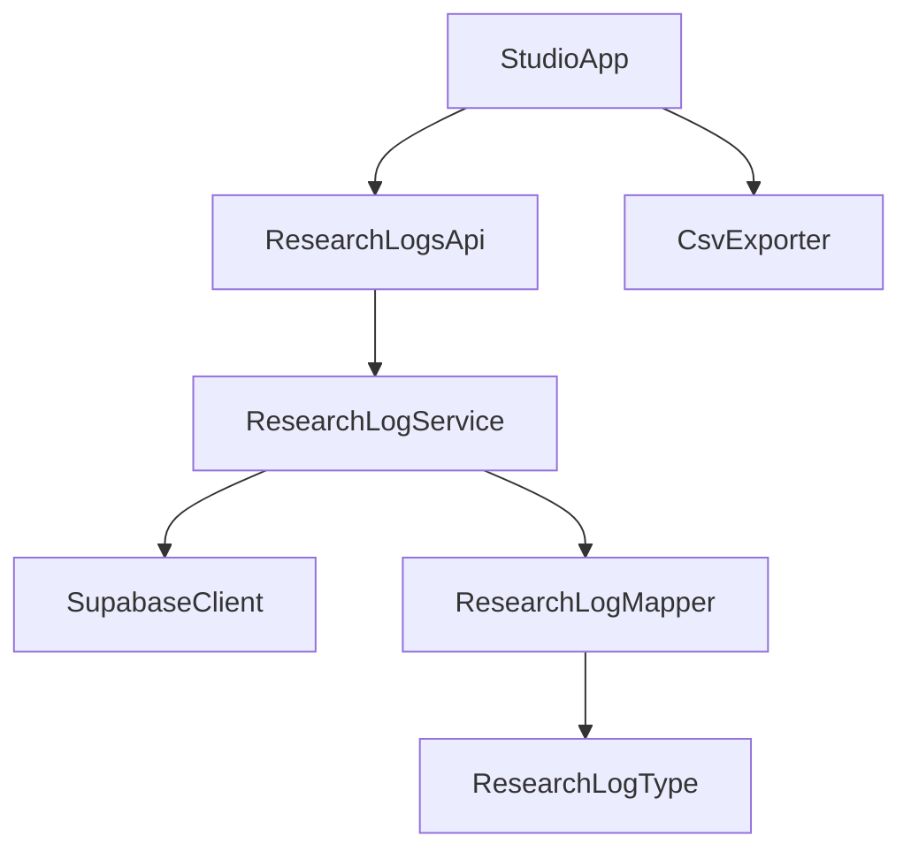
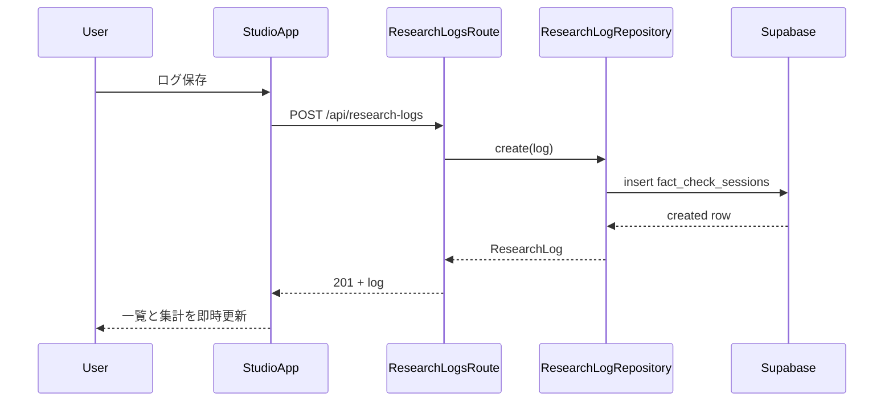
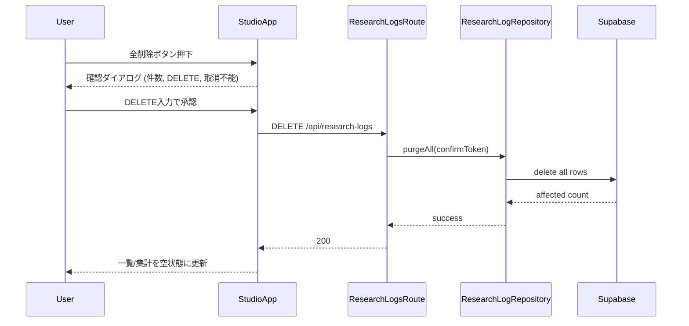
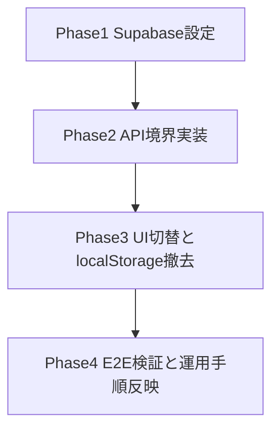

# Design Document

## Overview
本機能は、Climate Fact-Check Studio の監査ログ永続化を `localStorage` から Supabase `fact_check_sessions` へ切り替え、編集者・研究者がブラウザや端末を問わず同一ログ集合を共有できる状態を作る。既存の分析フロー（`StudioApp` → `/api/analyze` → `lib/analysis.ts`）は維持し、ログ保存・取得・CSV・全件削除のみを対象にデータアクセス境界を追加する。

実装方針は「UI は表示と入力状態、API は契約とエラー封筒、Repository は DB 操作」の責務分離とする。これにより、要件 7 の設定不足可視化と鍵露出防止、要件 8 の `ResearchLog` 契約維持を同時に満たす。

### Goals
- `ResearchLog` の保存/取得/全件削除を Supabase で一貫提供する。
- `localStorage` 永続化経路を完全に撤去し、Supabase を唯一の真実にする。
- 全件削除を確認語句付きで安全化し、誤操作時の破壊を防ぐ。

### Non-Goals
- Supabase Auth やユーザー単位アクセス制御の導入。
- 既存 `localStorage` データ移行。
- `lib/analysis.ts` の解析ロジック変更。

## Boundary Commitments

### This Spec Owns
- 監査ログ CRUD のうち **create/read/delete-all** を扱うアプリケーション境界。
- `ResearchLog` と `fact_check_sessions` の変換契約（`timestamp` ↔ `created_at` を含む）。
- 全件削除の確認ダイアログ要件と API 側再検証。

### Out of Boundary
- 認証、行レベル所有権、ユーザーごとのログ分離。
- 1 件単位更新/削除 UI、復元機能。
- 分析 API 契約や主張抽出ロジック。

### Allowed Dependencies
- `components/studio-app.tsx`（UI 状態とイベント起点）
- `app/api/research-logs/route.ts`（新規 API 境界）
- `lib/types.ts`（契約 SSOT）
- `lib/csv.ts`（CSV 仕様 SSOT）
- `docs/supabase-schema.sql`（DB 草案）

### Revalidation Triggers
- `ResearchLog` フィールド追加/削除/型変更。
- `fact_check_sessions` の列名変更（特に `created_at`）。
- ログ API のエラー封筒や HTTP ステータス契約変更。
- 無認証共有モデルから認証モデルへの方針転換。

## Architecture

### Existing Architecture Analysis
- `StudioApp` は `logs` をローカル状態管理し、`localStorage` 同期で永続化している。
- `app/api/analyze/route.ts` は薄いバリデーション境界として機能している。
- `lib` 層に I/O を直接持ち込まない方針が steering で定義済み。

### Architecture Pattern & Boundary Map
- Selected pattern: **API-mediated Repository**
- Domain/feature boundaries: UI は入力・表示、API は契約、Repository は Supabase I/O を担当。
- Existing patterns preserved: 単一 `StudioApp`、`lib/types.ts` SSOT、`@/` import、`lib/analysis.ts` 純粋性。
- New components rationale: `ResearchLogRepository` と Mapper を追加して契約ドリフトを局所化。
- Steering compliance: 依存方向を `app/components -> lib` に固定し、`lib` から UI 逆参照を禁止。



### Technology Stack

| Layer | Choice / Version | Role in Feature | Notes |
|-------|------------------|-----------------|-------|
| Frontend | React 19 / HeroUI v3 | ログ表示、削除確認ダイアログ、エラー通知 | 既存 `StudioApp` 拡張 |
| Backend | Next.js 16 Route Handler | `/api/research-logs` の GET/POST/DELETE | 既存 API パターン踏襲 |
| Data / Storage | Supabase Postgres + `@supabase/supabase-js` | `fact_check_sessions` 永続化 | anon key 利用、特権鍵禁止 |
| Domain | TypeScript 5.9 strict | 変換契約、エラー型、Repository 契約 | `any` 不使用 |
| Runtime | Bun | 既存開発/実行環境 | 追加ランタイムなし |

## File Structure Plan

### Directory Structure
```text
app/
└── api/
    ├── analyze/
    │   └── route.ts                           # 既存分析 API（変更なし）
    └── research-logs/
        └── route.ts                           # 監査ログ GET/POST/DELETE 契約境界

components/
└── studio-app.tsx                              # ログ取得/保存/全削除呼び出し、確認ダイアログ、エラー表示

lib/
├── types.ts                                    # ResearchLog 関連の API 入出力型を追加
├── csv.ts                                      # 既存 CSV ヘッダ契約を維持（必要時同期）
├── supabase/
│   └── server-client.ts                        # Supabase クライアント初期化と環境変数検証
└── research-log-repository.ts                  # DB row <-> ResearchLog 変換と CRUD 契約

docs/
├── supabase-schema.sql                         # テーブル草案（必要差分反映）
└── supabase-operations.md                      # RLS/公開アクセス設定と運用手順
```

### Modified Files
- `components/studio-app.tsx` — `localStorage` 読み書きを撤去し、`/api/research-logs` 呼び出しへ置換。削除確認ダイアログを追加。
- `lib/types.ts` — API 用エラー封筒・削除確認リクエスト型を追加。
- `app/api/analyze/route.ts` — 直接変更なし（境界維持を明示）。
- `lib/csv.ts` — ヘッダ契約維持、`ResearchLog` 追加項目発生時の同期ポイントとして更新余地を明示。

## System Flows





- 保存・削除失敗時は UI 状態を保持し、再実行可能な通知を返す。
- 初期取得失敗時は空表示ではなく失敗通知 + 再試行導線を表示する。

## Requirements Traceability

| Requirement | Summary | Components | Interfaces | Flows |
|-------------|---------|------------|------------|-------|
| 1.1 | 保存操作で1件登録 | StudioApp, ResearchLogsRoute, Repository | POST contract | 保存フロー |
| 1.2 | 保存成功時の即時反映・入力リセット | StudioApp | State update contract | 保存フロー |
| 1.3 | 保存失敗時の入力保持と通知 | StudioApp, ResearchLogsRoute | Error envelope | 保存フロー |
| 1.4 | 重複登録防止 | StudioApp, ResearchLogsRoute | Request idempotency contract | 保存フロー |
| 2.1 | 初期取得で各表示に反映 | StudioApp, ResearchLogsRoute | GET contract | 取得フロー |
| 2.2 | 取得中状態の可視化 | StudioApp | Loading state contract | 取得フロー |
| 2.3 | 新しい順の表示 | Repository, StudioApp | Sort contract | 取得フロー |
| 2.4 | 取得失敗時通知・再試行 | StudioApp, ResearchLogsRoute | Error envelope | 取得フロー |
| 2.5 | 保存成功直後の即時反映 | StudioApp | Local append contract | 保存フロー |
| 3.1 | CSV 出力対象の定義 | StudioApp, csv.ts | CSV export contract | 取得フロー |
| 3.2 | ヘッダ順固定 | csv.ts | Header contract | なし |
| 3.3 | 0件時CSV無効化 | StudioApp | UI state contract | なし |
| 3.4 | 配列の `;` 連結維持 | csv.ts | Array serialization contract | なし |
| 3.5 | フィールド追加時の同期 | types.ts, csv.ts, Repository | Schema sync contract | なし |
| 4.1 | 無認証で全件閲覧/CSV | StudioApp, ResearchLogsRoute | GET contract | 取得フロー |
| 4.2 | 書込許可をテーブル制御へ委譲 | ResearchLogsRoute, Repository | Supabase access contract | 保存フロー |
| 4.3 | 単一共有テーブル運用 | Repository, docs | Data ownership contract | 全フロー |
| 5.1 | localStorage 書込廃止 | StudioApp | Storage boundary | なし |
| 5.2 | localStorage 読込廃止 | StudioApp | Storage boundary | 初期化 |
| 5.3 | 既存データ移行なし | StudioApp, ResearchLogsRoute | Scope contract | なし |
| 5.4 | 残存 localStorage 無視 | StudioApp | Storage ignore rule | 初期化 |
| 6.1 | 全削除前の確認情報提示 | StudioApp | Confirm dialog contract | 削除フロー |
| 6.2 | DELETE 入力時のみ全件削除 | StudioApp, ResearchLogsRoute, Repository | DELETE contract | 削除フロー |
| 6.3 | キャンセル/不一致時は未削除 | StudioApp, ResearchLogsRoute | Validation contract | 削除フロー |
| 6.4 | 削除成功時の即時空表示 | StudioApp | State reset contract | 削除フロー |
| 6.5 | 0件時全削除無効化 | StudioApp | UI state contract | なし |
| 6.6 | 削除失敗時の状態保持 | StudioApp, ResearchLogsRoute | Error envelope | 削除フロー |
| 7.1 | 設定不足時の可視化エラー | SupabaseClient, ResearchLogsRoute, StudioApp | Config error contract | 全フロー |
| 7.2 | 特権鍵の非露出 | SupabaseClient, docs | Secret policy contract | 全フロー |
| 7.3 | 設定手順の文書化 | docs/supabase-operations.md | Ops documentation contract | なし |
| 8.1 | 全フィールド保存 | Repository | Insert mapping contract | 保存フロー |
| 8.2 | 同値で復元表示 | Repository, StudioApp | Read mapping contract | 取得フロー |
| 8.3 | snake_case 一致維持 | types.ts, Repository, schema.sql | Naming contract | 全フロー |
| 8.4 | 契約不整合時の顕在化 | Repository, ResearchLogsRoute, StudioApp | Schema mismatch error | 全フロー |

## Components and Interfaces

| Component | Domain/Layer | Intent | Req Coverage | Key Dependencies (P0/P1) | Contracts |
|-----------|--------------|--------|--------------|--------------------------|-----------|
| ResearchLogsRoute | API | ログ API の単一入口 | 1.1-2.5, 4.1-4.3, 6.2-6.3, 7.1, 8.4 | Repository(P0), StudioApp(P1) | API |
| ResearchLogRepository | Domain/Data | DB 操作と型変換の集中管理 | 1.1, 2.3, 4.3, 6.2, 8.1-8.4 | SupabaseClient(P0), types(P0) | Service |
| SupabaseServerClient | Infra | 環境変数検証と Supabase client 生成 | 7.1, 7.2 | process env(P0) | Service |
| StudioApp Log Layer | UI | 取得/保存/CSV/削除 UI と状態管理 | 1.2-1.4, 2.1-2.5, 3.1-3.3, 5.1-5.4, 6.1-6.6 | ResearchLogsRoute(P0), csv.ts(P0) | API, State |
| CsvExporter (`logsToCsv`) | Domain | CSV 契約維持 | 3.2-3.5, 8.2 | types(P0) | Service |
| Supabase Operations Doc | Docs | 運用設定手順と安全境界の明示 | 7.2, 7.3 | schema.sql(P0) | Batch |

### API Layer

#### ResearchLogsRoute

| Field | Detail |
|-------|--------|
| Intent | ログの GET/POST/DELETE を統一して扱う API 境界 |
| Requirements | 1.1, 1.3, 2.1, 2.4, 4.1, 4.2, 6.2, 6.3, 6.6, 7.1, 8.4 |

**Responsibilities & Constraints**
- `GET`: 新しい順で `ResearchLog[]` を返す。
- `POST`: 必須フィールドを検証し、成功時 201 で作成レコードを返す。
- `DELETE`: `confirmToken === "DELETE"` を検証し、不一致なら削除拒否。

**Dependencies**
- Inbound: `StudioApp` — ログ操作要求 (P0)
- Outbound: `ResearchLogRepository` — DB 操作 (P0)
- External: Next.js Route Handler runtime — HTTP I/O (P1)

**Contracts**: Service [ ] / API [x] / Event [ ] / Batch [ ] / State [ ]

##### API Contract
| Method | Endpoint | Request | Response | Errors |
|--------|----------|---------|----------|--------|
| GET | /api/research-logs | なし | `{ logs: ResearchLog[] }` | 500 |
| POST | /api/research-logs | `{ log: ResearchLogInput }` | `{ log: ResearchLog }` | 400, 409, 500 |
| DELETE | /api/research-logs | `{ confirmToken: "DELETE" }` | `{ deletedCount: number }` | 400, 500 |

### Domain/Data Layer

#### ResearchLogRepository

| Field | Detail |
|-------|--------|
| Intent | `ResearchLog` 契約で Supabase 永続化を抽象化 |
| Requirements | 1.1, 2.3, 4.3, 6.2, 8.1, 8.2, 8.3, 8.4 |

**Responsibilities & Constraints**
- `toDbRow`/`toResearchLog` で型変換を単一化。
- `created_at` を `timestamp` に正規化して返す。
- 契約不整合（列欠損・型不正）はエラーとして返し、欠落を黙殺しない。

**Dependencies**
- Inbound: `ResearchLogsRoute` — CRUD 要求 (P0)
- Outbound: `SupabaseServerClient` — DB access (P0)
- Outbound: `lib/types.ts` — 型契約 (P0)

**Contracts**: Service [x] / API [ ] / Event [ ] / Batch [ ] / State [ ]

##### Service Interface
```typescript
interface ResearchLogRepository {
  list(): Promise<ResearchLog[]>;
  create(input: ResearchLogInput): Promise<ResearchLog>;
  purgeAll(confirmToken: string): Promise<{ deletedCount: number }>;
}
```
- Preconditions: `confirmToken` は削除時に `DELETE`。
- Postconditions: 返却値は `ResearchLog` 契約に一致。
- Invariants: 保存・取得で snake_case 契約を維持。

#### SupabaseServerClient

| Field | Detail |
|-------|--------|
| Intent | 環境変数検証済み Supabase クライアントを提供 |
| Requirements | 7.1, 7.2 |

**Responsibilities & Constraints**
- URL/anon key 欠落時は明示エラーを返す。
- service role key は読み取らない。

**Contracts**: Service [x] / API [ ] / Event [ ] / Batch [ ] / State [ ]

### UI Layer

#### StudioApp Log Layer

| Field | Detail |
|-------|--------|
| Intent | ログ関連 UX（取得・保存・CSV・削除確認）を統合 |
| Requirements | 1.2, 1.4, 2.1, 2.2, 2.5, 3.1, 3.3, 5.1, 5.2, 5.4, 6.1, 6.3, 6.4, 6.5, 6.6 |

**Responsibilities & Constraints**
- 初期ロード、保存成功反映、失敗時再試行導線を提供。
- 全削除で件数・影響範囲・取消不能を明示。
- `localStorage` API を使用しない。

**Contracts**: Service [ ] / API [x] / Event [ ] / Batch [ ] / State [x]

## Data Models

### Domain Model
- `ResearchLog`（既存 SSOT）: UI と CSV の基準契約。
- `ResearchLogInput`: `id` 生成前の保存入力。
- `ResearchLogApiError`: `code`, `message`, `retryable` を持つ API エラー封筒。

### Logical Data Model
- エンティティ: `fact_check_sessions`
- 主キー: `id` (uuid)
- 時系列: `created_at` desc で取得
- 配列属性: `claims`, `sources`, `risks`, `revision_reason` は JSON 配列として保持

### Physical Data Model
- テーブル: `fact_check_sessions`
- インデックス: `created_at desc`, `topic`
- 追加提案: `id` 重複時 upsert 回避のユニーク制約は既存 PK で担保

### Data Contracts & Integration
- API 入力 `POST` は `ResearchLogInput` 必須。
- API 出力 `GET/POST` は `ResearchLog` のみ返却。
- DB 変換規則: `created_at -> timestamp`（ISO 8601）

## Error Handling

### Error Strategy
- 設定不足: 操作前に `CONFIG_MISSING` を返し、UI で再設定案内。
- DB 接続失敗: `DB_UNAVAILABLE` として再試行可能エラー。
- 契約不整合: `SCHEMA_MISMATCH` として操作停止。
- 削除確認不足: `DELETE_CONFIRMATION_REQUIRED` として 400。

### Error Categories and Responses
- **User Errors (4xx)**: 削除確認語句不一致、必須フィールド欠落。
- **System Errors (5xx)**: Supabase 接続失敗、予期しない DB 例外。
- **Business Logic Errors (422 相当)**: 契約不整合検知（運用修復が必要）。

### Monitoring
- ログ API の失敗率（GET/POST/DELETE 別）を記録。
- `SCHEMA_MISMATCH` と `CONFIG_MISSING` を高優先アラート化。

## Testing Strategy

### Unit Tests
- 1.1/8.1: `toDbRow` が `ResearchLog` 全フィールドを欠落なく変換する。
- 8.2/8.3: `toResearchLog` が `created_at` を `timestamp` に正規化する。
- 6.2/6.3: `purgeAll` が `DELETE` 以外を拒否する。
- 5.1/5.2: `StudioApp` ログ層に `localStorage` 呼び出しが残っていない。

### Integration Tests
- 2.1/2.3: `/api/research-logs` GET が新しい順で返す。
- 1.1/1.3: POST 成功/失敗時の API 封筒が契約通り。
- 6.4/6.6: DELETE 成功で空状態、失敗で状態維持。
- 7.1: 環境変数欠落時に `CONFIG_MISSING` を返す。

### E2E/UI Tests
- 2.1/2.5: 起動後一覧表示と保存直後反映が一画面で成立する。
- 3.1/3.3: CSV 出力ボタンが件数連動で有効/無効を切替える。
- 6.1-6.3: 全削除ダイアログの確認語句ガードが機能する。
- 5.4: 旧 `localStorage` データが存在しても表示に混入しない。

### Performance/Load
- 取得件数増加時でも初期表示待機が実務許容範囲内。
- 連続保存時の UI 応答劣化が発生しない。

## Security Considerations
- ブラウザへ配信されるコードに service role key を含めない。
- 削除 API は確認語句を必須とし、意図しない直接呼び出しを抑制。
- 無認証共有モデルのリスク（閲覧範囲広さ）を運用文書で明示する。

## Migration Strategy



- Phase1: `fact_check_sessions` 作成、RLS 設定、接続確認。
- Phase2: `research-logs` API と Repository を追加。
- Phase3: `StudioApp` を API 連携へ切替、`localStorage` 関連コード削除。
- Phase4: CSV・削除確認・設定不足時挙動を検証。
- Rollback Trigger: API 失敗率上昇または `SCHEMA_MISMATCH` 多発時は一時的に保存機能を停止し原因修正後再開。
